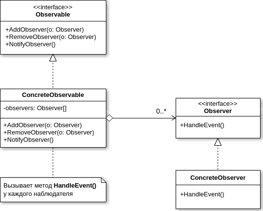
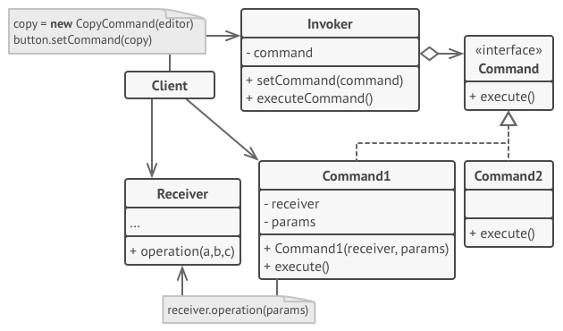
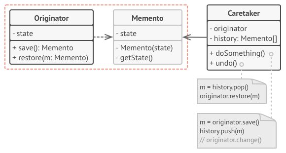
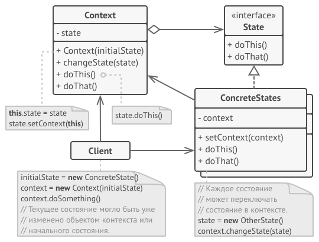

## GOF
### Behavioral

#### Observer

#### Command

  
Картинка [refactoring.guru](https://refactoring.guru/ru/design-patterns/command/)

#### Chain of Responsibility

  
Картинка [refactoring.guru](https://refactoring.guru/ru/design-patterns/chain-of-responsibility)

#### Memento

  
Картинка [refactoring.guru](https://refactoring.guru/ru/design-patterns/memento)

#### State

  
Картинка [refactoring.guru](https://refactoring.guru/ru/design-patterns/state)
