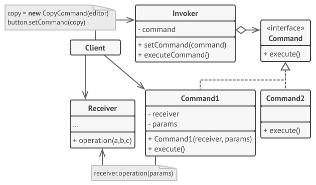
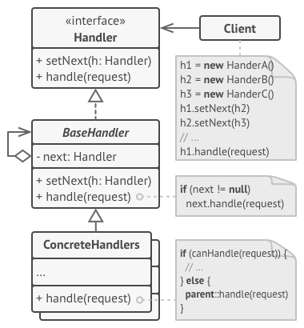
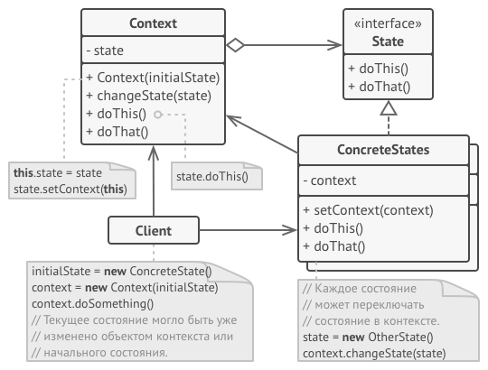
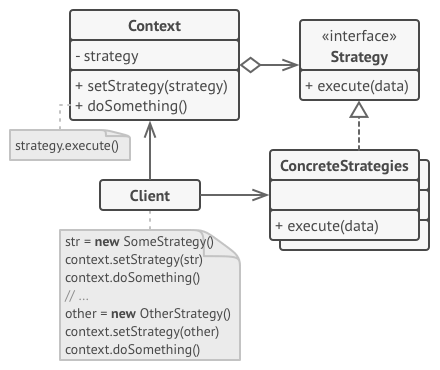
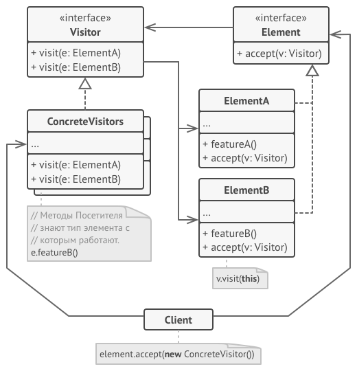
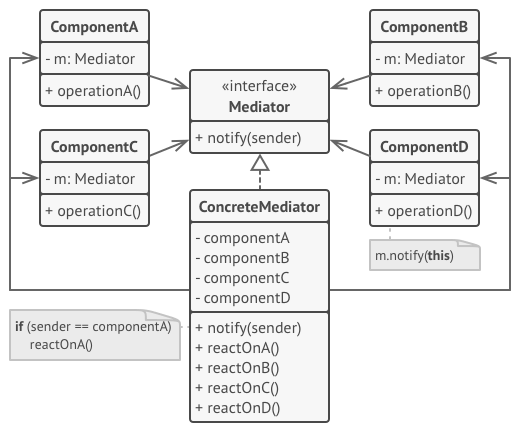
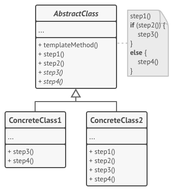

## GOF
### Behavioral

#### Observer

#### Command

  
Картинка [refactoring.guru](https://refactoring.guru/ru/design-patterns/command/)

#### Chain of Responsibility

  
Картинка [refactoring.guru](https://refactoring.guru/ru/design-patterns/chain-of-responsibility)

#### Memento

  
Картинка [refactoring.guru](https://refactoring.guru/ru/design-patterns/memento)

#### State

  
Картинка [refactoring.guru](https://refactoring.guru/ru/design-patterns/state)

#### Strategy

  
Картинка [refactoring.guru](https://refactoring.guru/ru/design-patterns/strategy)

#### Visitor

  
Картинка [refactoring.guru](https://refactoring.guru/ru/design-patterns/visitor)

#### Mediator

  
Картинка [refactoring.guru](https://refactoring.guru/ru/design-patterns/mediator)

#### Iterator

  
Картинка [refactoring.guru](https://refactoring.guru/ru/design-patterns/iterator)

#### Template Method

  
Картинка [refactoring.guru](https://refactoring.guru/ru/design-patterns/template-method)
