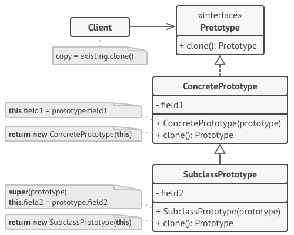
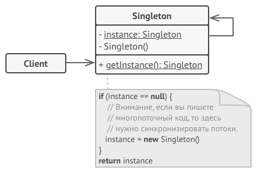

## GOF
### Creational

#### Factory method

  
Картинка [refactoring.guru](https://refactoring.guru/ru/design-patterns/factory-method)

#### Abstract factory

  
Картинка [refactoring.guru](https://refactoring.guru/ru/design-patterns/abstract-factory)

#### Builder

  
Картинка [refactoring.guru](https://refactoring.guru/ru/design-patterns/builder)

#### Prototype

  
Картинка [refactoring.guru](https://refactoring.guru/ru/design-patterns/prototype)

#### Singleton

  
Картинка [refactoring.guru](https://refactoring.guru/ru/design-patterns/singleton)
