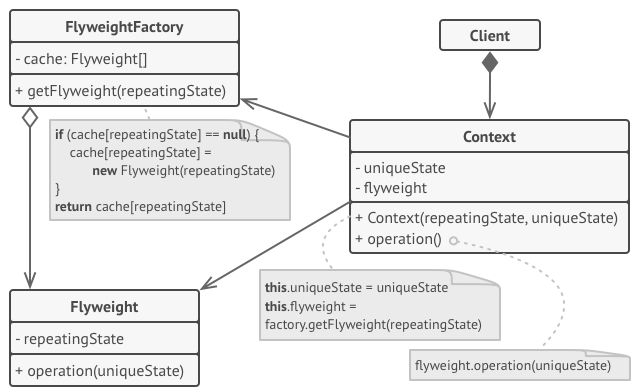
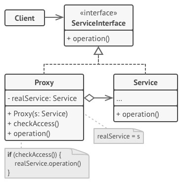
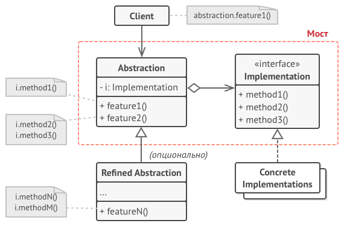

## GOF
### Structural

#### Adapter

Картинка [refactoring.guru](https://refactoring.guru/ru/design-patterns/adapter)

#### Composite

Картинка [refactoring.guru](https://refactoring.guru/ru/design-patterns/composite)

#### Decorator

Картинка [refactoring.guru](https://refactoring.guru/ru/design-patterns/decorator)

#### Facade

Картинка [refactoring.guru](https://refactoring.guru/ru/design-patterns/facade)

#### Flyweight

Картинка [refactoring.guru](https://refactoring.guru/ru/design-patterns/flyweight)

#### Proxy

Картинка [refactoring.guru](https://refactoring.guru/ru/design-patterns/proxy)

#### Bridge

Картинка [refactoring.guru](https://refactoring.guru/ru/design-patterns/bridge)
